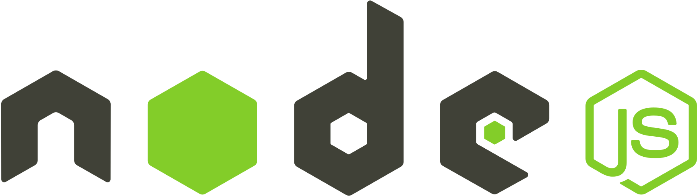
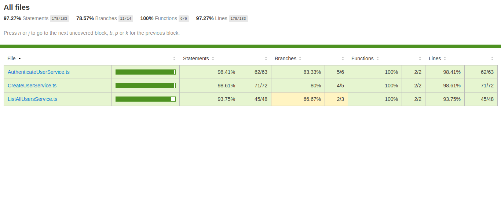

<h1 align="center">
  
  <br />
  <a href="https://www.linkedin.com/in/alexandre-costa-401699199">
    
  </a>
  <a href="https://github.com/alexandredev3/Node.js-API-solid-principles/issues">
    
  </a>
  <a href="https://github.com/alexandredev3/linkedin-clone//network">
    
  </a>
  <a href="https://github.com/alexandredev3/linkedin-clone//stargazers">
    
  </a>
</h1>
<p align="center">
  <a href="#page_facing_up-descrição">Descrição</a>&nbsp;&nbsp;&nbsp;|&nbsp;&nbsp;&nbsp;
  <a href="#-tecnologias">Tecnologias</a>&nbsp;&nbsp;&nbsp;|&nbsp;&nbsp;&nbsp;
    <a href="#clipboard-Funcionalidades">Funcionalidades</a>&nbsp;&nbsp;&nbsp;|&nbsp;&nbsp;&nbsp;
  <a href="#closed_book-instalação">Instalação</a>&nbsp;&nbsp;&nbsp;|&nbsp;&nbsp;&nbsp;
  <a href="#man-Autor">Autor</a>&nbsp;&nbsp;&nbsp;|&nbsp;&nbsp;&nbsp;
</p>



## :page_facing_up: Descrição
API de Autenticação com infraestrutura de software, seguindo o conceito SOLID e o Design Pattern de Dependency Injection no Node.js com Typescript.

## 🛠 Tecnologias
Este projeto foi desenvolvido com as seguintes tecnologias
### App
  - [Typescript](https://pt-br.reactjs.org/)
  - [Node.js](https://www.typescriptlang.org/)
  - [Tsyringe](https://styled-components.com/)
  - [Express](https://styled-components.com/)
  - [Celebrate](https://styled-components.com/)
 
### Banco de Dados
  - [Typeorm](https://styled-components.com/)
  - [Postgres](https://styled-components.com/)
  - [Redis](https://styled-components.com/)
  
### Testes
  - [Jest](https://styled-components.com/)
  
## :clipboard: Funcionalidades
  - [x] Criar usuários.
  - [x] Autenticar um usuário.
  - [x] Lista todos os usuários salvos no banco de dados.
  - [x] Salvar usuários listados em um sistema de Cache.
  - [x] Carregar usuários que foram salvos no Cache.
 
## :closed_book: Instalação

### Pré-requisitos
Antes de começar, você vai precisar ter instalado em sua máquina as seguintes ferramentas:
[Git](https://git-scm.com), [Node.js](https://nodejs.org/en/).
Além disto é bom ter um editor para trabalhar com o código como [VSCode](https://code.visualstudio.com/)

#### Iniciando Back-End
  ```bash
  # Clone este repositório;
  $ git clone https://github.com/alexandredev3/Node.js-API-solid-principles.git

  # Vá para a pasta onde esta o app;
  $ cd Node.js-API-solid-principles

  # Instale as dependências;
  $ yarn ou npm install

  # Execute aplicação;
  $ yarn dev ou npm run dev

  # O app vai está rodando na porta 3333 - acesse <http://localhost:3333>
  ```
  
#### Rodando Testes
  ```bash
  # Executando os testes com o Jest;
  $ yarn test ou npm run tests
  ```
  
## :man: Autor

<a href="https://github.com/alexandredev3/">
 
 <br />
 <sub><b>Alexandre Costa</b></sub>
</a>


Feito com ❤️ por Alexandre Costa :wave::wave: Entre em contato!🚀

<a href="https://www.linkedin.com/in/alexandre-costa-401699199">
  
</a>

